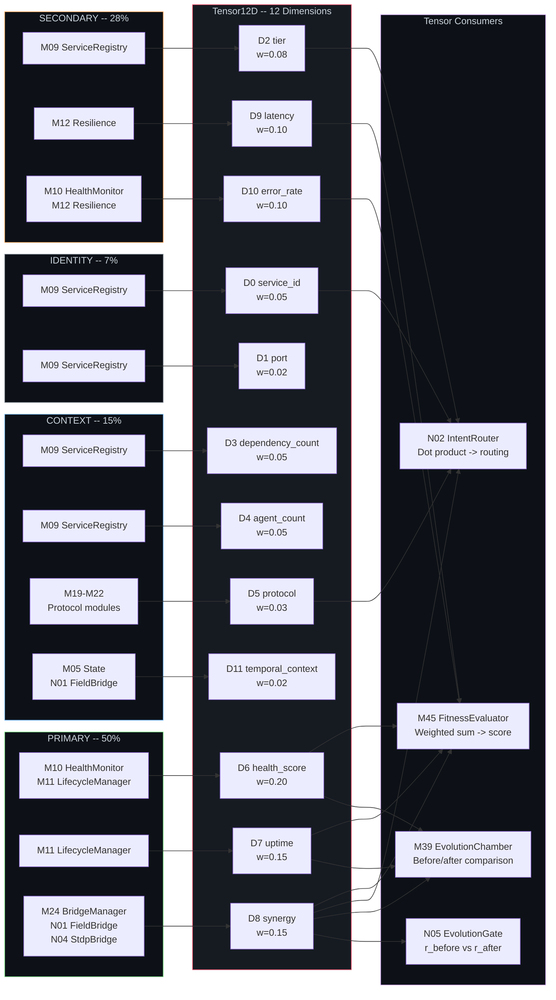
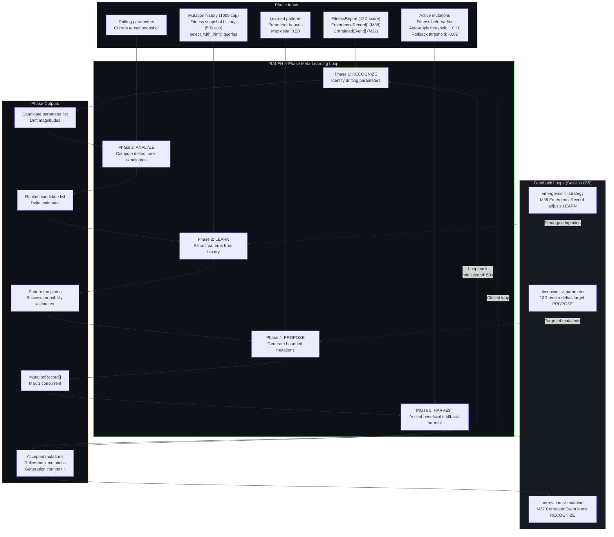
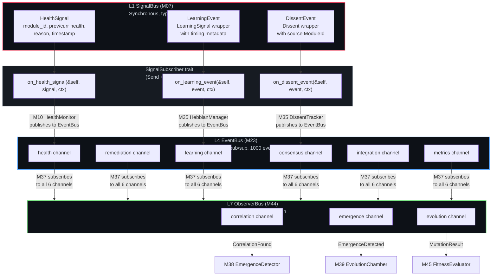
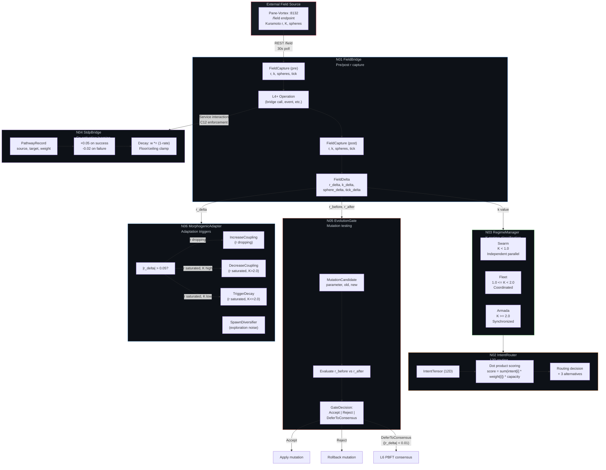
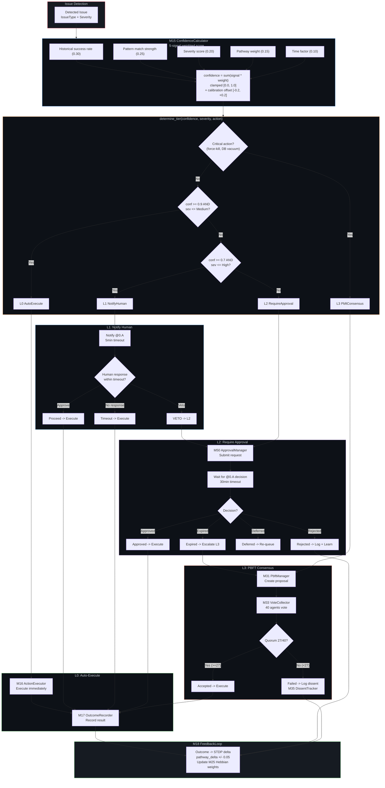

# Maintenance Engine V2 -- Architecture Schematics

> Comprehensive Mermaid diagrams covering all 8 layers, 48+ modules, data flows,
> tensor encoding, RALPH evolution, signal propagation, Nexus integration, and
> remediation escalation. Each diagram is annotated with key data types and
> gap/bottleneck findings (F1-F15).
>
> **Render:** Obsidian (```mermaid blocks), [mermaid.live](https://mermaid.live),
> or `npx mmdc -i ME_V2_ARCHITECTURE_SCHEMATICS.md -o schematics.png -t dark`

---

## Table of Contents

1. [Layer Architecture](#1-layer-architecture)
2. [Observer Pipeline](#2-observer-pipeline)
3. [Habitat Wiring](#3-habitat-wiring)
4. [12D Tensor Flow](#4-12d-tensor-flow)
5. [RALPH Evolution Loop](#5-ralph-evolution-loop)
6. [Signal Propagation](#6-signal-propagation)
7. [Nexus Integration](#7-nexus-integration)
8. [Remediation Escalation](#8-remediation-escalation)
9. [Navigation](#9-navigation)

---

## 1. Layer Architecture

**Purpose:** Shows the 8-layer module hierarchy with module counts and the strict
downward-only dependency DAG (constraint C1). Data flows upward through signals
(L1 `SignalBus`) and events (L4 `EventBus`), while control flows downward through
direct function calls.

```mermaid
graph TD
    subgraph L8["L8 Nexus Integration -- 6 modules"]
        N01["N01 FieldBridge<br/>Kuramoto r-tracking"]
        N02["N02 IntentRouter<br/>12D tensor routing"]
        N03["N03 RegimeManager<br/>K-regime detection"]
        N04["N04 StdpBridge<br/>Co-activation weights"]
        N05["N05 EvolutionGate<br/>Mutation gating"]
        N06["N06 MorphogenicAdapter<br/>|r_delta|>0.05 triggers"]
    end

    subgraph L7["L7 Observer -- 6 modules"]
        M37["M37 LogCorrelator<br/>4 correlation types"]
        M38["M38 EmergenceDetector<br/>8 emergence types"]
        M39["M39 EvolutionChamber<br/>RALPH 5-phase loop"]
        M40["M40 ThermalMonitor<br/>SYNTHEX polling"]
        M44["M44 ObserverBus<br/>3 internal channels"]
        M45["M45 FitnessEvaluator<br/>12D weighted scoring"]
    end

    subgraph L6["L6 Consensus -- 8 modules"]
        M31["M31 PbftManager<br/>n=40, f=13, q=27"]
        M32["M32 AgentCoordinator<br/>5 agent roles"]
        M33["M33 VoteCollector<br/>Weighted votes"]
        M34["M34 ViewChangeHandler<br/>Leader rotation"]
        M35["M35 DissentTracker<br/>NAM-R3 compliance"]
        M36["M36 QuorumCalculator<br/>2f+1 threshold"]
        M48["M48 Checkpoint<br/>State snapshots"]
        M49["M49 ActiveDissent<br/>Cascade semantics"]
    end

    subgraph L5["L5 Learning -- 9 modules"]
        M25["M25 HebbianManager<br/>Pathway weights"]
        M26["M26 StdpProcessor<br/>LTP/LTD +/-0.1/0.05"]
        M27["M27 PatternRecognizer<br/>Temporal patterns"]
        M28["M28 PathwayPruner<br/>Dead pathway removal"]
        M29["M29 MemoryConsolidator<br/>Short->long term"]
        M30["M30 AntipatternDetector<br/>Failure patterns"]
        M41["M41 DecayScheduler<br/>HRS-001 corrected"]
        M46["M46 Prediction<br/>Future state forecasting"]
        M47["M47 Sequence<br/>Temporal sequence learning"]
    end

    subgraph L4["L4 Integration -- 12 modules"]
        M19["M19 RestClient<br/>HTTP/REST"]
        M20["M20 GrpcClient<br/>gRPC"]
        M21["M21 WebSocketClient<br/>WS streaming"]
        M22["M22 IpcManager<br/>Unix domain sockets"]
        M23["M23 EventBus<br/>6 channels, pub/sub"]
        M24["M24 BridgeManager<br/>Health + synergy"]
        M24b["M24b PeerBridge<br/>Mesh health"]
        M24c["M24c ToolRegistrar<br/>Tool Library reg"]
        M51["M51 Auth<br/>Token management"]
        M52["M52 RateLimiter<br/>Tier-based limiting"]
        M53["M53 CascadeBridge<br/>Multi-hop relay"]
        M54["M54 OracBridge<br/>ORAC hook events"]
    end

    subgraph L3["L3 Core Logic -- 7 modules"]
        M13["M13 PipelineManager<br/>Stage orchestration"]
        M14["M14 RemediationEngine<br/>Auto-remediation"]
        M15["M15 ConfidenceCalc<br/>5-signal scoring"]
        M16["M16 ActionExecutor<br/>Action dispatch"]
        M17["M17 OutcomeRecorder<br/>Result tracking"]
        M18["M18 FeedbackLoop<br/>Learning feedback"]
        M50["M50 ApprovalManager<br/>L2/L3 workflow"]
    end

    subgraph L2["L2 Services -- 5 modules"]
        M09["M09 ServiceRegistry<br/>53 tests"]
        M10["M10 HealthMonitor<br/>49 tests"]
        M11["M11 LifecycleManager<br/>75 tests"]
        M12["M12 Resilience<br/>CB + LB, 82 tests"]
        L2mod["L2 Coordinator<br/>20 tests"]
    end

    subgraph L1["L1 Foundation -- 11 modules"]
        M00["M00 SharedTypes<br/>Timestamp, Duration"]
        M01["M01 Error<br/>Error taxonomy"]
        M02["M02 Config<br/>Configuration"]
        M03["M03 Logging<br/>Structured logs"]
        M04["M04 Metrics<br/>Metrics collector"]
        M05["M05 State<br/>State persistence"]
        M06["M06 Resources<br/>Resource manager"]
        M07["M07 SignalBus<br/>3 signal channels"]
        M08["M08 TensorRegistry<br/>12D tensor store"]
        M43["M43 NAM<br/>NAM foundation"]
        M55["M55 SelfModel<br/>Introspective state"]
    end

    L8 --> L7
    L7 --> L6
    L7 --> L5
    L6 --> L5
    L5 --> L4
    L4 --> L3
    L3 --> L2
    L2 --> L1

    style L8 fill:#1a1a2e,stroke:#e94560,color:#fff
    style L7 fill:#1a1a2e,stroke:#0f3460,color:#fff
    style L6 fill:#1a1a2e,stroke:#16213e,color:#fff
    style L5 fill:#1a1a2e,stroke:#533483,color:#fff
    style L4 fill:#1a1a2e,stroke:#e94560,color:#fff
    style L3 fill:#1a1a2e,stroke:#0f3460,color:#fff
    style L2 fill:#1a1a2e,stroke:#16213e,color:#fff
    style L1 fill:#1a1a2e,stroke:#533483,color:#fff
```



**Key data types flowing through:**
- L1 -> L2: `Error`, `Result<T>`, `Timestamp`, `Duration`, `Signal`, `TensorContribution`
- L2 -> L3: `ServiceState`, `HealthResult`, `CircuitBreakerState`
- L3 -> L4: `RemediationRequest`, `RemediationAction`, `EscalationTier`
- L4 -> L5: `EventRecord`, `BridgeStatus`, `SynergyScore`
- L5 -> L6: `HebbianPathway`, `PatternMatch`, `StdpWeight`
- L6 -> L7: `ConsensusProposal`, `VoteResult`, `DissentRecord`
- L7 -> L8: `FitnessReport`, `EmergenceRecord`, `MutationRecord`

**Bottleneck annotations:**
- **F1**: M23 EventBus has 333K+ events but 0 external subscribers at runtime
- **F8**: ME `dependency_count` tensor D3 frozen at 0.083 (1/12 normalized)
- **F14**: L5 Hebbian weights not hydrated on restart (saved=4722, restored=0)

---

## 2. Observer Pipeline

**Purpose:** Shows the M37 -> M38 -> M39 data flow within L7, illustrating how raw
EventBus events are progressively refined into correlated events, emergence records,
and finally mutation records through the RALPH loop.

```mermaid
flowchart LR
    subgraph EventBus["M23 EventBus<br/>6 channels"]
        HC["health<br/>channel"]
        RC["remediation<br/>channel"]
        LC["learning<br/>channel"]
        CC["consensus<br/>channel"]
        IC["integration<br/>channel"]
        MC["metrics<br/>channel"]
    end

    subgraph M37["M37 LogCorrelator"]
        ING["Ingest<br/>IngestedEvent"]
        COR["Correlate<br/>4 link types"]
        WIN["Window<br/>5000ms default"]
    end

    subgraph M38["M38 EmergenceDetector"]
        DET["Detect<br/>8 emergence types"]
        SEV["Classify<br/>EmergenceSeverity"]
        HIS["History<br/>1000 cap"]
    end

    subgraph M39["M39 EvolutionChamber"]
        REC["Recognize<br/>Drift detection"]
        ANA["Analyze<br/>Delta ranking"]
        LRN["Learn<br/>Pattern extraction"]
        PRO["Propose<br/>Bounded mutations"]
        HAR["Harvest<br/>Accept/rollback"]
    end

    subgraph M45["M45 FitnessEvaluator"]
        FIT["12D Weighted<br/>Fitness Score"]
        TRD["Trend<br/>Detection"]
    end

    subgraph M44["M44 ObserverBus"]
        OB1["correlation<br/>channel"]
        OB2["emergence<br/>channel"]
        OB3["evolution<br/>channel"]
    end

    HC & RC & LC & CC & IC & MC -->|"EventRecord<br/>id, channel, type, payload"| ING
    ING --> COR
    COR -->|"CorrelatedEvent<br/>links[], confidence"| OB1
    OB1 --> DET
    DET --> SEV
    SEV -->|"EmergenceRecord<br/>type, severity, services[]"| OB2
    OB2 --> REC
    REC --> ANA
    ANA --> LRN
    LRN --> PRO
    PRO -->|"MutationRecord<br/>parameter, delta, fitness"| OB3
    OB3 --> HAR
    HAR -->|"fitness_before/after"| FIT
    FIT --> TRD
    TRD -->|"FitnessReport<br/>score, trend, stability"| REC

    style EventBus fill:#0d1117,stroke:#58a6ff,color:#c9d1d9
    style M37 fill:#0d1117,stroke:#f78166,color:#c9d1d9
    style M38 fill:#0d1117,stroke:#d2a8ff,color:#c9d1d9
    style M39 fill:#0d1117,stroke:#7ee787,color:#c9d1d9
    style M45 fill:#0d1117,stroke:#ffa657,color:#c9d1d9
    style M44 fill:#0d1117,stroke:#79c0ff,color:#c9d1d9
```



**Key data types:**

| Stage | Input Type | Output Type | Volume |
|-------|-----------|-------------|--------|
| M23 -> M37 | `EventRecord` | `IngestedEvent` | ~333K events total |
| M37 -> M38 | `CorrelatedEvent` (links[], confidence) | `EmergenceRecord` (type, severity) | Filtered by 0.6 min confidence |
| M38 -> M39 | `EmergenceRecord` (services[], score) | `MutationRecord` (param, delta) | Filtered by 0.7 min confidence |
| M39 -> M45 | `Tensor12D` snapshot | `FitnessReport` (score, trend) | Per generation cycle |

**Correlation types (M37):**
- `Temporal`: `1.0 - (|delta_ms| / 500ms)` -- events close in time
- `Causal`: `0.8 * (1.0 - delta_ms / 5000ms)` -- cascading errors
- `Semantic`: `layers_count / 6.0` -- cross-layer scope
- `Recurring`: `1.0 - (stddev / mean)` -- pattern repetition

**Emergence types (M38):**
`CascadeFailure`, `SynergyShift`, `ResonanceCycle`, `AttractorFormation`,
`PhaseTransition`, `BeneficialEmergence`, `CascadeAmplification`, `ThermalRunaway`

**Bottleneck annotations:**
- **F1**: M37 LogCorrelator starved -- 0 correlations produced because EventBus has 0 runtime publishers
- **F5**: M39 RALPH generation running but mutations have minimal impact due to upstream starvation
- **F12**: M40 ThermalMonitor oscillation (0.91->0.68->0.92) indicates PID tuning needed

---

## 3. Habitat Wiring

**Purpose:** Shows how ME V2 (port 8080) connects to all 17 ULTRAPLATE services,
with protocol type, port, and polling/push semantics for each connection.

```mermaid
graph TB
    ME["ME V2<br/>:8080<br/>L4 BridgeManager"]

    subgraph Batch1["Batch 1 -- No Dependencies"]
        DEVOPS["DevOps Engine<br/>:8081<br/>REST"]
        CS7["CodeSynthor V7<br/>:8110<br/>REST+WS"]
        POVM["POVM Engine<br/>:8125<br/>REST"]
    end

    subgraph Batch2["Batch 2 -- Needs B1"]
        SYNTHEX["SYNTHEX<br/>:8090/:8091<br/>REST+WS"]
        SANK7["SAN-K7<br/>:8100<br/>REST+IPC"]
        ARCH["Architect Agent<br/>:9001+<br/>REST"]
        PROM["Prometheus Swarm<br/>:10001+<br/>REST"]
    end

    subgraph Batch3["Batch 3 -- Needs B2"]
        NAIS["NAIS<br/>:8101<br/>REST"]
        BASH["Bash Engine<br/>:8102<br/>REST+IPC"]
        TOOL["Tool Maker<br/>:8103<br/>REST+gRPC"]
    end

    subgraph Batch4["Batch 4 -- Needs B3"]
        CCM["Context Manager<br/>:8104<br/>REST"]
        TLIB["Tool Library<br/>:8105<br/>REST"]
        RM["Reasoning Memory<br/>:8130<br/>REST (TSV!)"]
    end

    subgraph Batch5["Batch 5 -- Needs B4"]
        VMS["Vortex Memory<br/>:8120<br/>REST"]
        PV2["Pane-Vortex<br/>:8132<br/>REST"]
        ORAC["ORAC Sidecar<br/>:8133<br/>REST"]
    end

    ME -->|"REST /health poll 30s"| DEVOPS
    ME -->|"REST+WS real-time"| CS7
    ME -->|"REST /store, /recall"| POVM
    ME -->|"REST+WS /v3/thermal 30s"| SYNTHEX
    ME -->|"REST+IPC /health poll 30s"| SANK7
    ME -->|"REST /health poll 60s"| ARCH
    ME -->|"REST /health poll 60s"| PROM
    ME -->|"REST /health poll 30s"| NAIS
    ME -->|"REST+IPC /parse /check"| BASH
    ME -->|"REST+gRPC /health 30s"| TOOL
    ME -->|"REST /health poll 30s"| CCM
    ME -->|"REST /register tools"| TLIB
    ME -->|"REST TSV /records 60s"| RM
    ME -->|"REST /health poll 30s"| VMS
    ME -->|"REST /field 30s"| PV2
    ME -->|"REST /health + hooks"| ORAC

    ME -.->|"M54 OracBridge<br/>6 hook events"| ORAC
    ME -.->|"N01 FieldBridge<br/>Kuramoto r capture"| PV2
    ME -.->|"N04 StdpBridge<br/>pathway weights"| POVM

    style ME fill:#e94560,stroke:#fff,color:#fff,stroke-width:3px
    style Batch1 fill:#0d1117,stroke:#58a6ff,color:#c9d1d9
    style Batch2 fill:#0d1117,stroke:#7ee787,color:#c9d1d9
    style Batch3 fill:#0d1117,stroke:#d2a8ff,color:#c9d1d9
    style Batch4 fill:#0d1117,stroke:#ffa657,color:#c9d1d9
    style Batch5 fill:#0d1117,stroke:#f78166,color:#c9d1d9
```



**Protocol matrix:**

| Service | Port | Protocol | Interval | Direction |
|---------|------|----------|----------|-----------|
| DevOps Engine | 8081 | REST | 30s poll | ME -> DevOps |
| SYNTHEX | 8090/8091 | REST+WS | 30s poll + WS push | Bidirectional |
| SAN-K7 | 8100 | REST+IPC | 30s poll | ME -> SAN-K7 |
| NAIS | 8101 | REST | 30s poll | ME -> NAIS |
| Bash Engine | 8102 | REST+IPC | On-demand | ME -> Bash |
| Tool Maker | 8103 | REST+gRPC | 30s poll | Bidirectional |
| Context Manager | 8104 | REST | 30s poll | ME -> CCM |
| Tool Library | 8105 | REST | On registration | ME -> TLib |
| CodeSynthor V7 | 8110 | REST+WS | Real-time | Bidirectional |
| VMS | 8120 | REST | 30s poll | ME -> VMS |
| POVM | 8125 | REST | On-demand | ME <-> POVM |
| Reasoning Memory | 8130 | REST (TSV) | 60s poll | ME <-> RM |
| Pane-Vortex | 8132 | REST | 30s poll | ME -> PV2 |
| ORAC Sidecar | 8133 | REST+Hooks | Event-driven | Bidirectional |
| Architect Agent | 9001+ | REST | 60s poll | ME -> Arch |
| Prometheus Swarm | 10001+ | REST | 60s poll | ME -> Prom |

**Bottleneck annotations:**
- **F1**: EventBus -> PV2 bridge missing -- 0 external subscribers for 333K events
- **F3**: ORAC bridge (M54) sends 6 hook event types but response handling is minimal
- **F7**: Prometheus Swarm crash on certain CVA-NAM agent configurations
- **F9**: Tool Maker agent registry returns stale data after restart

---

## 4. 12D Tensor Flow

**Purpose:** Maps each of the 12 tensor dimensions to the modules that contribute
values, with dimension weights from the FitnessEvaluator (M45).



**Dimension weight breakdown:**

| Category | Dimensions | Total Weight | Primary Contributor |
|----------|-----------|-------------|---------------------|
| Primary | D6, D7, D8 | 50% | M10, M11, M24, N01, N04 |
| Secondary | D2, D9, D10 | 28% | M09, M12 |
| Context | D3, D4, D5, D11 | 15% | M09, M19-M22, M05, N01 |
| Identity | D0, D1 | 7% | M09 |

**Fitness formula (M45):**
```
score = sum(D[i] * W[i]) for i in 0..12
      = 0.05*D0 + 0.02*D1 + 0.08*D2 + 0.05*D3 + 0.05*D4 + 0.03*D5
      + 0.20*D6 + 0.15*D7 + 0.15*D8 + 0.10*D9 + 0.10*D10 + 0.02*D11
```

**Bottleneck annotations:**
- **F8**: D3 `dependency_count` frozen at 0.083 (1/12) -- ME only sees itself
- **F10**: D8 `synergy` dominated by static bridge topology weights, not live data
- **F11**: D11 `temporal_context` contribution from N01 FieldBridge is placeholder

---

## 5. RALPH Evolution Loop

**Purpose:** Shows the 5-phase RALPH (Recognize-Analyze-Learn-Propose-Harvest)
meta-learning cycle implemented in M39 EvolutionChamber, with inputs and outputs
at each phase.



**RALPH constants:**

| Parameter | Value | Purpose |
|-----------|-------|---------|
| `max_concurrent_mutations` | 3 | Limits blast radius |
| `mutation_verification_ms` | 30,000 | Verification timeout |
| `fitness_history_capacity` | 500 | M39 snapshot buffer |
| `mutation_history_capacity` | 1,000 | Completed mutation log |
| `auto_apply_threshold` | +0.10 | Accept without consensus |
| `rollback_threshold` | -0.02 | Automatic rollback |
| `min_generation_interval_ms` | 60,000 | Prevent mutation storms |
| `max_mutation_delta` | 0.20 | Bound parameter changes |

**MutationStatus lifecycle:**
```
Proposed -> Verifying -> Accepted
                      -> RolledBack
                      -> Failed
```

**Bottleneck annotations:**
- **F5**: RALPH running but upstream data pipeline (M37) is starved due to F1
- **F13**: `select_with_hint()` LEARN phase queries 3 sources but VMS morphogenic_cycle was 0
- **F15**: LTP/LTD ratio at 0.055 (target >0.15) suggests STDP learning is underperforming

---

## 6. Signal Propagation

**Purpose:** Contrasts the L1 SignalBus (synchronous, 3 typed channels) with the
L4 EventBus (async, 6 named channels) and shows how they connect.



**Signal vs Event comparison:**

| Feature | L1 SignalBus | L4 EventBus | L7 ObserverBus |
|---------|-------------|-------------|----------------|
| Layer | L1 Foundation | L4 Integration | L7 Observer |
| Delivery | Synchronous | Pub/sub, fire-and-forget | Fire-and-forget |
| Channels | 3 (typed) | 6 (named strings) | 3 (internal) |
| Capacity | 256 subscribers | 1000 event log | 500 per channel |
| Types | `HealthSignal`, `LearningEvent`, `DissentEvent` | `EventRecord` (generic) | `ObserverMessage` |
| Scope | Intra-L1 module coordination | Cross-layer distribution | L7-internal M37/M38/M39 |
| Context | `SignalContext` (module, timestamp, correlation_id) | Channel + event_type filter | `ObserverSource` enum |

**Connection bridge:**
L1 signals propagate upward through subscriber implementations in higher layers.
When M10 receives a `HealthSignal`, it publishes to the L4 EventBus `health` channel.
M37 LogCorrelator subscribes to all 6 EventBus channels, bridging L4 to L7.
Within L7, the ObserverBus distributes messages between M37, M38, M39, and M45.

**Bottleneck annotations:**
- **F1**: L4 EventBus has 0 external subscribers -- events accumulate but never leave ME
- **F4**: L1 SignalBus -> L4 EventBus bridge works internally but M23.publish() calls are missing in main.rs runtime loop

---

## 7. Nexus Integration

**Purpose:** Shows the N01-N06 module chain with the Kuramoto field capture pattern,
K-regime classification, and morphogenic adaptation flow.



**Kuramoto parameters:**

| Parameter | Value | Regime |
|-----------|-------|--------|
| K_SWARM_THRESHOLD | 1.0 | K < 1.0 = independent parallel |
| K_ARMADA_THRESHOLD | 2.0 | K >= 2.0 = synchronized convergence |
| R_THRESHOLD | 0.05 | \|r_delta\| trigger for morphogenic adaptation |
| DEFER_THRESHOLD | 0.01 | \|r_delta\| too small to decide -> PBFT |
| K_COUPLING_DELTA | 0.1 | Step size per adaptation |

**Field capture pattern (constraint C11):**
```rust
let r_before = nexus.field_coherence();
/* ... L4+ operation ... */
let r_after = nexus.field_coherence();
let r_delta = r_after - r_before;
if r_delta.abs() > 0.05 {
    nexus.trigger_morphogenic_adaptation(r_delta);
}
```

**Bottleneck annotations:**
- **F2**: N01 FieldBridge polling PV2 but field_state never fully populated in ORAC
- **F6**: N06 MorphogenicAdapter decisions flow to N04 StdpBridge but pathway weights reset on restart (F14)
- **F11**: N01 temporal_context contribution to D11 is placeholder

---

## 8. Remediation Escalation

**Purpose:** Shows the 4-tier escalation system (L0-L3) with confidence thresholds,
severity gates, and approval/PBFT decision points.



**Escalation tier matrix:**

| Tier | Confidence | Severity | Timeout | Decision Path |
|------|-----------|----------|---------|---------------|
| L0 AutoExecute | >= 0.9 | <= Medium | 0 | Immediate execution |
| L1 NotifyHuman | >= 0.7 | <= High | 5min | Notify, proceed if no response |
| L2 RequireApproval | < 0.7 OR sev=High | Any | 30min | Wait for @0.A decision |
| L3 PbftConsensus | N/A (action-based) | Critical | Quorum | 27/40 agent votes required |

**L3-triggering actions (always PBFT regardless of confidence):**
- `ServiceRestart { graceful: false }` -- force-kill
- `DatabaseVacuum { .. }` -- potential service disruption

**Confidence formula:**
```
confidence = 0.30 * historical_success_rate
           + 0.25 * pattern_match_strength
           + 0.20 * severity_score
           + 0.15 * pathway_weight
           + 0.10 * time_factor
```
Result clamped to [0.0, 1.0], then calibration offset applied (bounded [-0.2, +0.2]).

**PBFT parameters:**

| Parameter | Value |
|-----------|-------|
| n (total agents) | 40 |
| f (Byzantine tolerance) | 13 |
| q (quorum = 2f+1) | 27 |
| Agent roles | 20 VALIDATOR, 8 EXPLORER, 6 CRITIC, 4 INTEGRATOR, 2 HISTORIAN |

**NAM-R5 compliance:** Only agent `@0.A` may render human decisions (L1/L2 paths).

**Bottleneck annotations:**
- **F7**: Prometheus Swarm crash affects L3 quorum when CVA-NAM agents are unavailable
- **F14**: L5 Hebbian weights (pathway_weight signal in confidence) not hydrated on restart

---

## Finding Reference (F1-F15)

| Finding | Severity | Description | Affected Diagrams |
|---------|----------|-------------|-------------------|
| F1 | CRITICAL | EventBus has 333K events, 0 external subscribers | 1, 2, 3, 6 |
| F2 | HIGH | N01 FieldBridge field_state never fully populated | 7 |
| F3 | MEDIUM | ORAC bridge hook response handling minimal | 3 |
| F4 | HIGH | SignalBus -> EventBus bridge: publish() calls missing in runtime | 6 |
| F5 | HIGH | RALPH starved due to upstream M37 data pipeline empty | 2, 5 |
| F6 | HIGH | MorphogenicAdapter pathway updates lost on restart | 7 |
| F7 | HIGH | Prometheus Swarm crash affects PBFT quorum | 3, 8 |
| F8 | MEDIUM | D3 dependency_count frozen at 0.083 | 1, 4 |
| F9 | MEDIUM | Tool Maker agent registry returns stale data | 3 |
| F10 | MEDIUM | D8 synergy uses static topology not live data | 4 |
| F11 | LOW | D11 temporal_context N01 contribution is placeholder | 4, 7 |
| F12 | MEDIUM | ThermalMonitor oscillation suggests PID tuning needed | 2 |
| F13 | MEDIUM | VMS morphogenic_cycle was 0, LEARN phase underperforming | 5 |
| F14 | CRITICAL | Hebbian weights not hydrated on restart (4722 saved, 0 restored) | 1, 5, 8 |
| F15 | HIGH | LTP/LTD ratio 0.055 vs target 0.15 | 5 |

---

## 9. Navigation

- [SESSION_068_RECOMMENDATIONS.md](../SESSION_068_RECOMMENDATIONS.md) -- Session 068 findings and recommended fixes
- [META_TREE_MIND_MAP_V2.md](../META_TREE_MIND_MAP_V2.md) -- Full module tree with dependency analysis
- [ADVANCED_EVOLUTION_CHAMBER_V2.md](../ADVANCED_EVOLUTION_CHAMBER_V2.md) -- Evolution Chamber deep-dive
- [HABITAT_INTEGRATION_SPEC.md](../../ai_specs/HABITAT_INTEGRATION_SPEC.md) -- Cross-service wiring specification
- [MASTER_INDEX.md](../../MASTER_INDEX.md) -- Project master index

---

*Generated: 2026-03-28 | Source: ME V2 codebase analysis (48+ modules, 8 layers, 62K+ LOC)*
*Covers: Layer DAG, Observer pipeline, Habitat mesh, 12D tensor, RALPH loop, Signal/Event buses, Nexus integration, Escalation tiers*
