# M1+M2 Unified Architecture — Claude Code Reference

> **Purpose:** Single-document cross-layer integration view for Claude Code instances implementing L3-L8.
> **Scope:** L1 Foundation (M00-M08, 16,711 LOC) + L2 Services (M09-M12, 7,196 LOC)
> **Optimized for:** Fast context reconstruction, trait lookup, dimension mapping, implementation guidance.
> **Generated:** 2026-03-07 | **Source:** 16 Rust files verified against source

---

## Quick Reference: What L3+ Needs From L1+L2

```
IMPORT:  use crate::m1_foundation::{Error, Result, Timestamp, ModuleId, ...};
         use crate::m2_services::{ServiceRegistry, HealthMonitor, ...};
TRAITS:  impl TensorContributor for YourModule { ... }
SIGNALS: self.signal_bus.as_ref().map(|bus| bus.emit_health(...));
LOCK:    parking_lot::RwLock<InternalState> — all methods &self
BUILD:   YourStruct::builder("id").field(val).build()?
TEST:    fn _assert_object_safe(_: &dyn YourTrait) {}
```

---

## 1. Full System Topology (M1+M2 Unified)

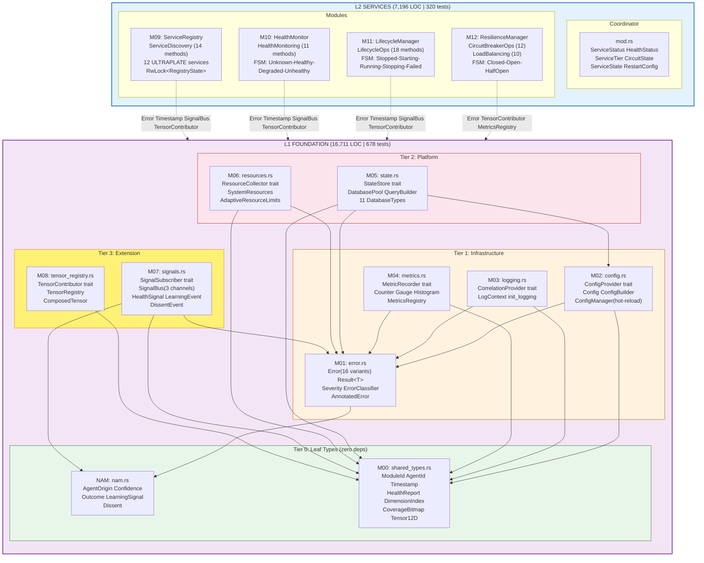

---

## 2. Trait → Implementor → Dimension Map

Complete lookup table for every trait defined in L1+L2 and what implements it.

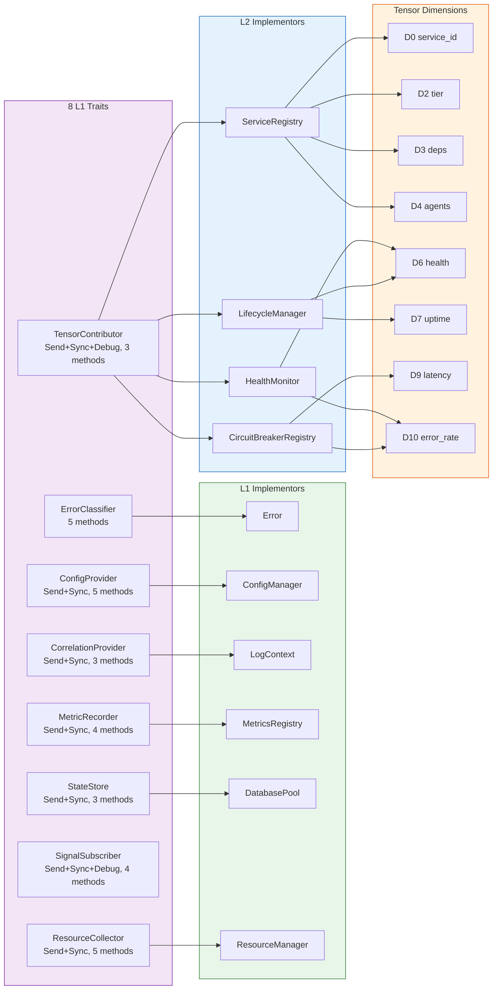

### Machine-Parseable Trait Index

| Trait | Module | Bounds | Methods | Defaults | Object-Safe | Arc&lt;dyn&gt; |
|-------|--------|--------|---------|----------|-------------|------------|
| `ErrorClassifier` | M01 | none | 5 | 2 | YES | no |
| `ConfigProvider` | M02 | Send+Sync | 5 | 2 | YES | `Arc<dyn ConfigProvider>` |
| `CorrelationProvider` | M03 | Send+Sync | 3 | 1 | YES | no |
| `MetricRecorder` | M04 | Send+Sync | 4 | 0 | YES | no |
| `StateStore` | M05 | Send+Sync | 3 | 1 | YES | no |
| `ResourceCollector` | M06 | Send+Sync | 5 | 2 | YES | no |
| `SignalSubscriber` | M07 | Send+Sync+Debug | 4 | 3 | YES | `Arc<dyn SignalSubscriber>` |
| `TensorContributor` | M08 | Send+Sync+Debug | 3 | 0 | YES | `Arc<dyn TensorContributor>` |
| `ServiceDiscovery` | M09 | Send+Sync | 14 | 0 | YES | no |
| `HealthMonitoring` | M10 | Send+Sync | 11 | 0 | YES | no |
| `LifecycleOps` | M11 | Send+Sync | 18 | 0 | YES | no |
| `CircuitBreakerOps` | M12 | Send+Sync | 12 | 0 | YES | no |
| `LoadBalancing` | M12 | Send+Sync | 10 | 0 | YES | no |

### Dimension Coverage Matrix

| Dim | Name | M09 | M10 | M11 | M12 | L1 Freestanding | L3+ Target |
|-----|------|-----|-----|-----|-----|-----------------|-----------|
| D0 | service_id | `count/12` | | | | LogContext | |
| D1 | port | | | | | Config | |
| D2 | tier | `avg tier` | | | | Config, Resources | |
| D3 | deps | `avg/12` | | | | | |
| D4 | agents | `healthy%` | | | | | |
| D5 | protocol | | | | | LogContext | M19-M22 |
| D6 | health | | `aggregate` | `%running` | | Config, Resources | |
| D7 | uptime | | | `1-restarts` | | | |
| D8 | synergy | | | | | | M24, N01, N04 |
| D9 | latency | | | | `closed%` | Resources | |
| D10 | error_rate | | `1-health` | | `fail_rate` | Metrics, Resources | |
| D11 | temporal | | | | | | M05, N01 |

**Coverage:** L1+L2 = 8/12 (67%). Gaps: D1(port), D5(protocol), D8(synergy), D11(temporal) — filled by L3+.

---

## 3. End-to-End Request Lifecycle

Complete sequence showing how a request flows through M1 types and M2 services.

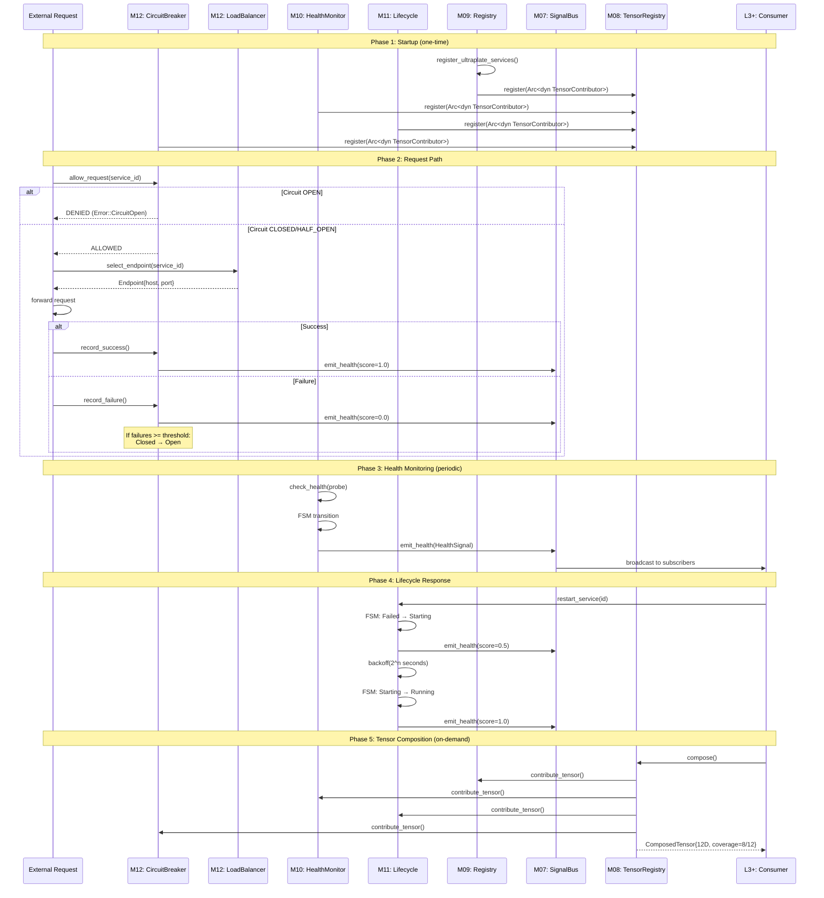

---

## 4. Three FSMs (Side-by-Side Reference)

### 4a. M10 Health Monitor FSM

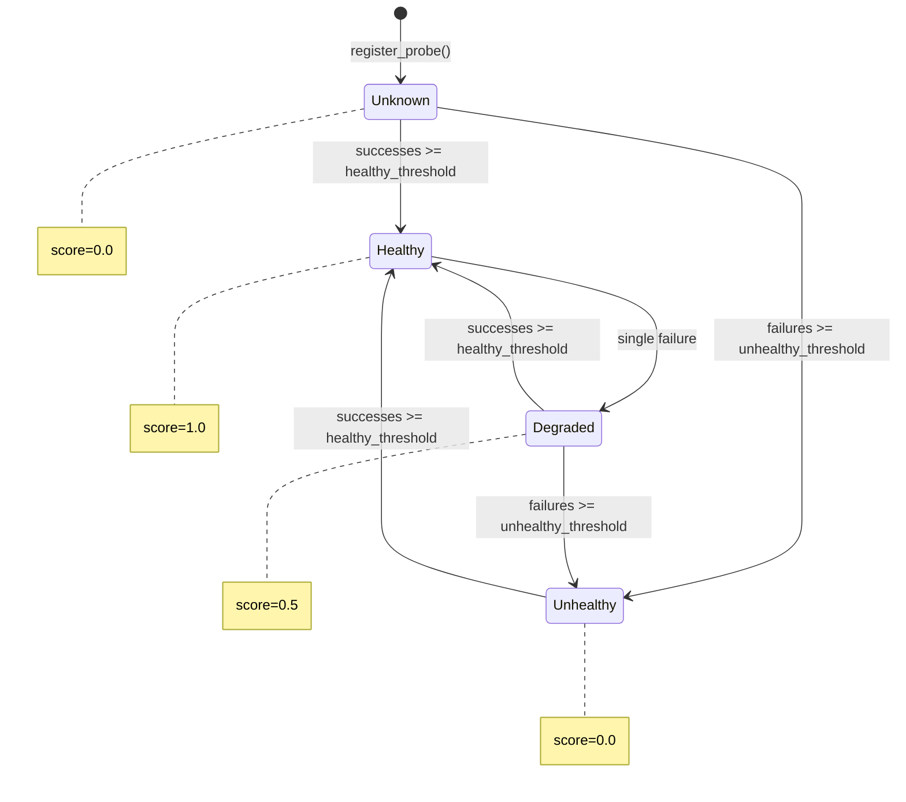

### 4b. M11 Lifecycle FSM

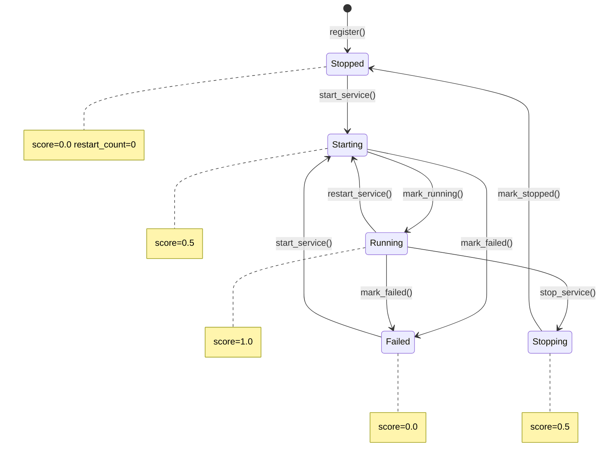

### 4c. M12 Circuit Breaker FSM

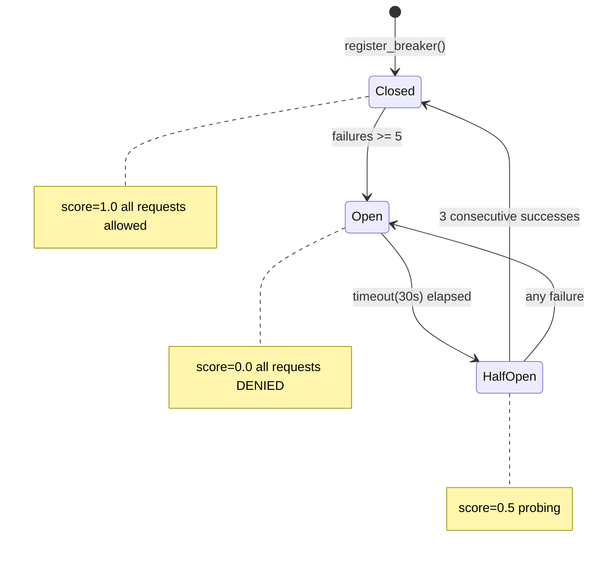

### FSM Quick Reference

| FSM | States | Healthy State | Degraded State | Trigger Events |
|-----|--------|--------------|----------------|----------------|
| Health (M10) | Unknown→Healthy→Degraded→Unhealthy | Healthy(1.0) | Degraded(0.5) | `record_result()` |
| Lifecycle (M11) | Stopped→Starting→Running→Stopping→Failed | Running(1.0) | Starting/Stopping(0.5) | `start/stop/restart_service()` |
| Circuit (M12) | Closed→Open→HalfOpen | Closed(1.0) | HalfOpen(0.5) | `record_success/failure()` |

---

## 5. Signal Emission & Consumption Flow

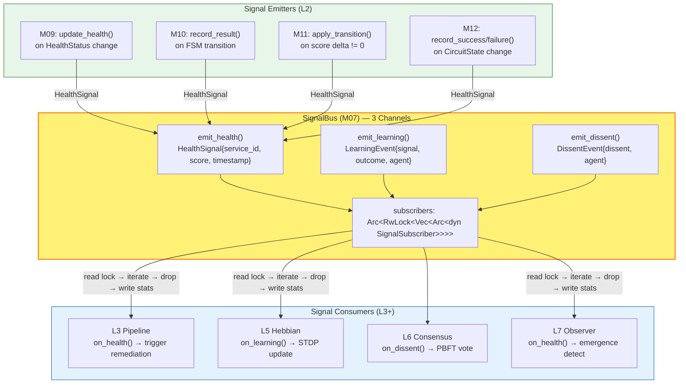

**Emission Rule:** Signals fire ONLY on state transitions (old != new), not on every API call.

**Lock Protocol:** Read subscribers → call callbacks → drop guard → write stats. Never nested.

---

## 6. Concurrency & Lock Ordering

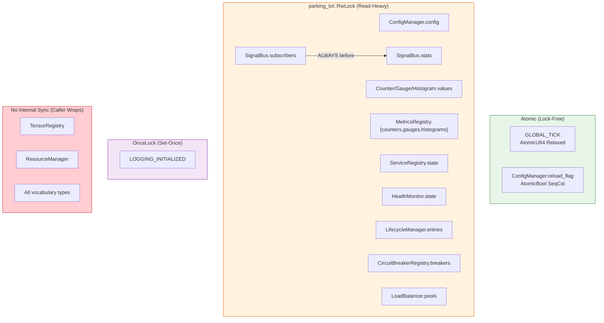

### Lock Ordering Rules (L3+ MUST follow)

1. **SignalBus:** subscribers lock BEFORE stats lock (never reversed)
2. **L2 Managers:** Each has exactly ONE `RwLock` — no nesting possible
3. **Signal emission:** ALWAYS release the manager's lock BEFORE calling `signal_bus.emit()`
4. **Cross-module:** Never hold locks from two different modules simultaneously
5. **All data crossing lock boundaries:** Clone/owned — never return references through guards

---

## 7. Error Propagation Topology

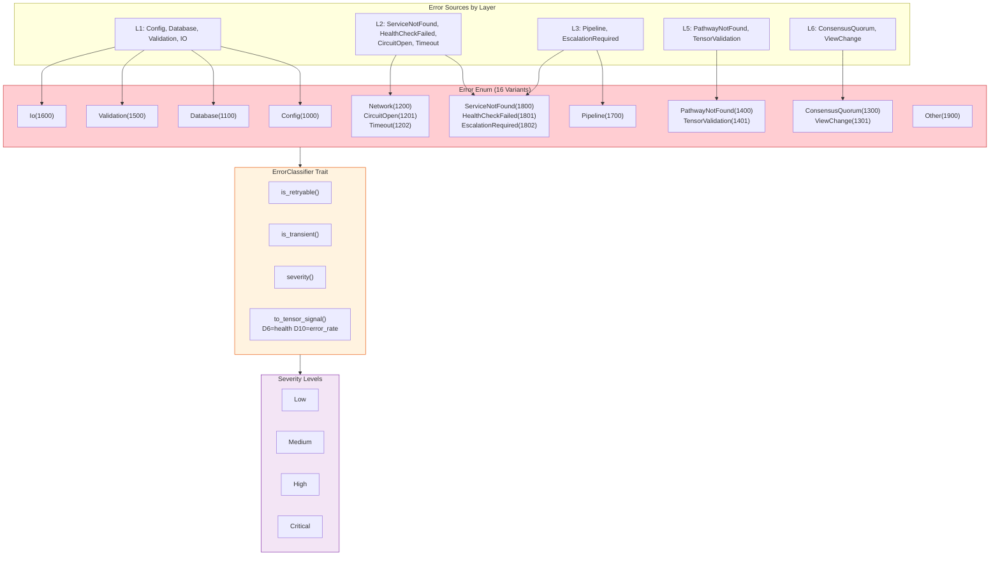

### Retryability Map

| Error | Retryable | Transient | Severity | Tensor Impact |
|-------|-----------|-----------|----------|---------------|
| Config | NO | NO | Medium | D6=0.5 |
| Database | YES | YES | High | D6=0.3, D10=0.7 |
| Network | YES | YES | Medium | D9=0.8 |
| CircuitOpen | NO | YES | High | D6=0.0, D9=1.0 |
| Timeout | YES | YES | Medium | D9=0.9 |
| Validation | NO | NO | Low | D10=0.3 |
| ServiceNotFound | NO | NO | High | D6=0.0 |
| Pipeline | YES | NO | High | D6=0.3 |

---

## 8. Interior Mutability Pattern (Template for L3+)

Every L2 manager follows this exact pattern. L3+ modules MUST follow it too.

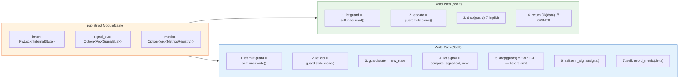

### Rust Template

```rust
use parking_lot::RwLock;
use crate::m1_foundation::{
    Error, Result, Timestamp, ModuleId, Tensor12D,
    CoverageBitmap, DimensionIndex, SignalBus, MetricsRegistry,
    TensorContributor, TensorContribution,
};

pub struct YourModule {
    inner: RwLock<YourState>,
    signal_bus: Option<Arc<SignalBus>>,
    metrics: Option<Arc<MetricsRegistry>>,
}

struct YourState {
    // ... internal mutable state
}

impl YourModule {
    #[must_use]
    pub fn new() -> Self { /* ... */ }

    pub fn with_signal_bus(mut self, bus: Arc<SignalBus>) -> Self {
        self.signal_bus = Some(bus);
        self
    }

    // Read: clone through lock, return owned
    pub fn get_status(&self) -> Result<YourStatus> {
        let guard = self.inner.read();
        Ok(guard.status.clone())
    }

    // Write: mutate, compute signal, drop lock, THEN emit
    pub fn update(&self, input: Input) -> Result<()> {
        let signal = {
            let mut guard = self.inner.write();
            let old = guard.value;
            guard.value = input.new_value;
            (old != guard.value).then(|| HealthSignal { /* ... */ })
        }; // guard dropped here
        if let Some(sig) = signal {
            if let Some(bus) = &self.signal_bus {
                bus.emit_health(sig);
            }
        }
        Ok(())
    }
}

impl TensorContributor for YourModule {
    fn module_id(&self) -> ModuleId { ModuleId::new(YOUR_MODULE_ID) }

    fn contribute_tensor(&self) -> TensorContribution {
        let guard = self.inner.read();
        let mut tensor = Tensor12D::default();
        let mut coverage = CoverageBitmap::empty();
        // Set your dimensions:
        tensor[DimensionIndex::D6] = guard.health_score;
        coverage = coverage.with_dimension(DimensionIndex::D6);
        TensorContribution::Snapshot { tensor, coverage }
    }

    fn contribution_type(&self) -> &'static str { "snapshot" }
}
```

---

## 9. ULTRAPLATE Service Bootstrap Map

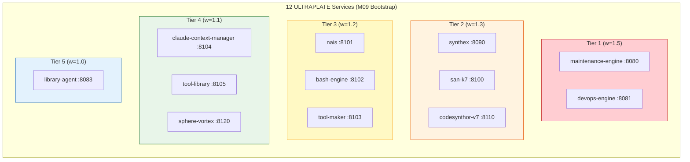

---

## 10. Tensor Composition Pipeline (L1+L2 Unified)

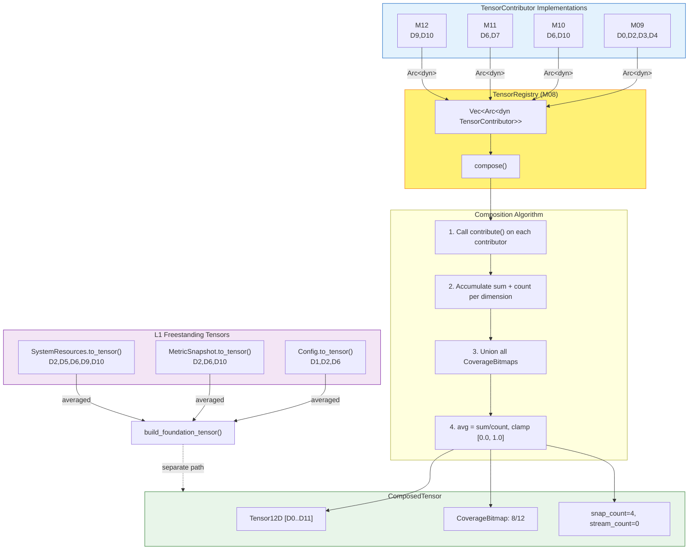

---

## 11. Implementation Checklist for L3+ Modules

Every new module MUST satisfy these requirements (derived from L1+L2 gold standard):

| # | Requirement | Pattern | Verified By |
|---|-------------|---------|-------------|
| 1 | `impl TensorContributor` | See template in Section 8 | Compile-time (C3) |
| 2 | All methods `&self` | `parking_lot::RwLock<Inner>` | Code review (C2) |
| 3 | No upward imports | `use crate::m1_foundation::*` only | Compile-time (C1) |
| 4 | Zero unsafe/unwrap/expect | `#![forbid(unsafe_code)]` | Clippy (C4) |
| 5 | Signal emission on transitions | `Arc<SignalBus>` field | Architecture (C6) |
| 6 | Owned returns through locks | Clone before returning | Code review (C7) |
| 7 | Builder pattern for constructors | `YourBuilder::new().field(v).build()?` | Convention |
| 8 | `#[must_use]` on pure functions | All getters, builders | Clippy pedantic |
| 9 | `Result<T>` everywhere | No panic paths | Clippy deny |
| 10 | 50+ tests per layer | Unit + FSM + signal + tensor | CI gate (C10) |
| 11 | Timestamp/Duration only | No chrono/SystemTime | Grep (C5) |
| 12 | Drop lock before emit | Explicit scope or drop() | Code review |

---

## 12. Cross-Layer Type Flow Summary

```
L1 EXPORTS → L2 CONSUMES → L3+ CONSUMES
─────────────────────────────────────────
Error, Result<T>          → All modules      → All modules
Timestamp, Duration       → All time fields  → All time fields
ModuleId (42 IDs)         → ServiceState     → Pipeline, Agent
AgentOrigin (4 variants)  → —                → Agent, PBFT
Confidence (0.0-1.0)      → —                → Pipeline, Consensus
Outcome (3 variants)      → —                → Learning, Feedback
LearningSignal            → —                → Hebbian, STDP
Dissent                   → —                → PBFT, Consensus
SignalBus (3 channels)    → All managers      → All modules
TensorContributor         → 4 impls (M09-12) → All new modules
CoverageBitmap            → TensorContrib    → TensorContrib
Tensor12D                 → ServiceState      → All tensor ops
HealthSignal              → emit on change   → subscribe in L3+
DimensionIndex (12 dims)  → contribute()     → contribute()
```

---

*M1+M2 Unified Architecture Reference v1.0 | 2026-03-07 | Optimized for Claude Code L3+ Implementation*
