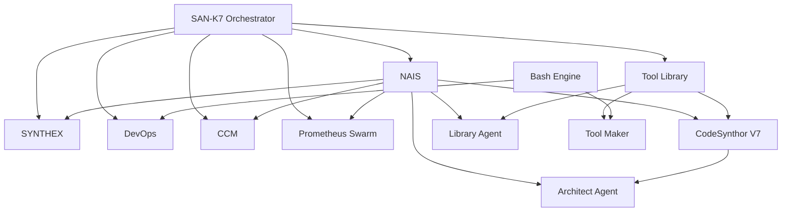

# ULTRAPLATE Service Specification

## Overview

ULTRAPLATE defines the 12 core services comprising the production system architecture. Each service operates within a tiered structure with defined weights, protocols, and service level objectives (SLOs).

---

## 12 ULTRAPLATE Services

### Service Registry

| # | Service | Port(s) | Tier | Weight | Protocol |
|---|---------|---------|------|--------|----------|
| 1 | SYNTHEX | 8090/8091 | 1 | 1.5 | REST/WS |
| 2 | SAN-K7 Orchestrator | 8100 | 1 | 1.5 | REST |
| 3 | NAIS | 8101 | 2 | 1.3 | REST |
| 4 | CodeSynthor V7 | 8110 | 2 | 1.3 | REST |
| 5 | DevOps Engine | 8081 | 2 | 1.3 | REST |
| 6 | Tool Library | 8105 | 3 | 1.2 | REST |
| 7 | Library Agent | 8083 | 3 | 1.2 | REST |
| 8 | CCM | 8104 | 3 | 1.2 | REST |
| 9 | Prometheus Swarm | 10001+ | 4 | 1.1 | REST |
| 10 | Architect Agent | 9001+ | 4 | 1.1 | REST |
| 11 | Bash Engine | 8102 | 5 | 1.0 | IPC |
| 12 | Tool Maker | 8103 | 5 | 1.0 | gRPC |

---

## Service Tiers

### Tier Overview

| Tier | Services | Priority | SLO | Description |
|------|----------|----------|-----|-------------|
| 1 | SYNTHEX, SAN-K7 | Critical | 99.9% | Core orchestration services |
| 2 | NAIS, CodeSynthor, DevOps | High | 99.5% | Intelligence and code services |
| 3 | Tools, CCM, Library | Medium | 99.0% | Support and tooling services |
| 4 | Prometheus, Architect | Normal | 98.0% | Swarm and architecture services |
| 5 | Bash, Tool Maker | Low | 95.0% | Utility and creation services |

### Tier Weight Distribution
- **Tier 1**: Weight 1.5 - Highest priority in routing and resource allocation
- **Tier 2**: Weight 1.3 - High priority for intelligent operations
- **Tier 3**: Weight 1.2 - Medium priority for tooling
- **Tier 4**: Weight 1.1 - Normal priority for swarm operations
- **Tier 5**: Weight 1.0 - Baseline priority for utilities

---

## Service Descriptions

### 1. SYNTHEX (Tier 1)

**Purpose**: Synthetic Intelligence Test and Execution framework

| Property | Value |
|----------|-------|
| Ports | 8090 (REST), 8091 (WebSocket) |
| Weight | 1.5 |
| SLO | 99.9% |
| Protocol | REST/WebSocket |

**Capabilities**:
- Test orchestration and execution
- Synthetic data generation
- Performance benchmarking
- Load testing coordination

---

### 2. SAN-K7 Orchestrator (Tier 1)

**Purpose**: System-wide service orchestration and coordination

| Property | Value |
|----------|-------|
| Port | 8100 |
| Weight | 1.5 |
| SLO | 99.9% |
| Protocol | REST |

**Capabilities**:
- Service lifecycle management
- Cross-service coordination
- Resource allocation
- Health monitoring aggregation

---

### 3. NAIS (Tier 2)

**Purpose**: Neural Autonomous Intelligence System

| Property | Value |
|----------|-------|
| Port | 8101 |
| Weight | 1.3 |
| SLO | 99.5% |
| Protocol | REST |

**Capabilities**:
- Neural routing decisions
- Autonomous problem solving
- Pattern recognition
- Learning coordination

---

### 4. CodeSynthor V7 (Tier 2)

**Purpose**: Code synthesis and transformation engine

| Property | Value |
|----------|-------|
| Port | 8110 |
| Weight | 1.3 |
| SLO | 99.5% |
| Protocol | REST |

**Capabilities**:
- Code generation
- Code transformation
- Syntax optimization
- Multi-language support

---

### 5. DevOps Engine (Tier 2)

**Purpose**: DevOps automation and pipeline management

| Property | Value |
|----------|-------|
| Port | 8081 |
| Weight | 1.3 |
| SLO | 99.5% |
| Protocol | REST |

**Capabilities**:
- CI/CD pipeline management
- Deployment automation
- Environment configuration
- Infrastructure as code

---

### 6. Tool Library (Tier 3)

**Purpose**: Centralized tool repository and management

| Property | Value |
|----------|-------|
| Port | 8105 |
| Weight | 1.2 |
| SLO | 99.0% |
| Protocol | REST |

**Capabilities**:
- Tool registration
- Tool discovery
- Version management
- Usage analytics

---

### 7. Library Agent (Tier 3)

**Purpose**: Intelligent library and dependency management

| Property | Value |
|----------|-------|
| Port | 8083 |
| Weight | 1.2 |
| SLO | 99.0% |
| Protocol | REST |

**Capabilities**:
- Dependency resolution
- Library recommendations
- Compatibility checking
- Update coordination

---

### 8. CCM - Claude Code Manager (Tier 3)

**Purpose**: Claude Code integration and session management

| Property | Value |
|----------|-------|
| Port | 8104 |
| Weight | 1.2 |
| SLO | 99.0% |
| Protocol | REST |

**Capabilities**:
- Claude Code session management
- Context preservation
- Tool orchestration
- Response coordination

---

### 9. Prometheus Swarm (Tier 4)

**Purpose**: Distributed agent swarm for parallel processing

| Property | Value |
|----------|-------|
| Ports | 10001+ (dynamic allocation) |
| Weight | 1.1 |
| SLO | 98.0% |
| Protocol | REST |

**Capabilities**:
- Agent spawning and management
- Parallel task execution
- Swarm coordination
- Load distribution

---

### 10. Architect Agent (Tier 4)

**Purpose**: System architecture analysis and recommendations

| Property | Value |
|----------|-------|
| Ports | 9001+ (dynamic allocation) |
| Weight | 1.1 |
| SLO | 98.0% |
| Protocol | REST |

**Capabilities**:
- Architecture analysis
- Design recommendations
- Pattern detection
- Technical debt assessment

---

### 11. Bash Engine (Tier 5)

**Purpose**: Shell command execution and automation

| Property | Value |
|----------|-------|
| Port | 8102 |
| Weight | 1.0 |
| SLO | 95.0% |
| Protocol | IPC |

**Capabilities**:
- Shell command execution
- Script automation
- Environment management
- Output processing

---

### 12. Tool Maker (Tier 5)

**Purpose**: Dynamic tool creation and compilation

| Property | Value |
|----------|-------|
| Port | 8103 |
| Weight | 1.0 |
| SLO | 95.0% |
| Protocol | gRPC |

**Capabilities**:
- Tool generation
- Code compilation
- Binary distribution
- Tool validation

---

## Health Endpoints

### Service Health URLs

| Service | Health URL | Method |
|---------|------------|--------|
| SYNTHEX | http://localhost:8090/api/health | GET |
| SAN-K7 Orchestrator | http://localhost:8100/health | GET |
| NAIS | http://localhost:8101/health | GET |
| CodeSynthor V7 | http://localhost:8110/health | GET |
| DevOps Engine | http://localhost:8081/health | GET |
| Tool Library | http://localhost:8105/health | GET |
| Library Agent | http://localhost:8083/health | GET |
| CCM | http://localhost:8104/health | GET |
| Prometheus Swarm | http://localhost:10001/health | GET |
| Architect Agent | http://localhost:9001/health | GET |
| Bash Engine | unix:///tmp/bash-engine.sock | IPC |
| Tool Maker | grpc://localhost:8103/health | gRPC |

### Health Response Schema
```json
{
  "service": "string",
  "status": "healthy|degraded|unhealthy",
  "timestamp": "ISO8601",
  "version": "string",
  "uptime_seconds": 0,
  "checks": {
    "database": "ok|error",
    "memory": "ok|warning|error",
    "dependencies": "ok|partial|error"
  },
  "metrics": {
    "requests_per_second": 0.0,
    "avg_latency_ms": 0.0,
    "error_rate": 0.0
  }
}
```

---

## Dependency Matrix

### Service Dependencies

| Service | Depends On | Dependency Type |
|---------|------------|-----------------|
| SYNTHEX | SAN-K7, NAIS | Critical |
| SAN-K7 Orchestrator | None (Root) | - |
| NAIS | SAN-K7 | Critical |
| CodeSynthor V7 | NAIS, Tool Library | High |
| DevOps Engine | SAN-K7, Bash Engine | High |
| Tool Library | SAN-K7 | Medium |
| Library Agent | Tool Library, NAIS | Medium |
| CCM | SAN-K7, NAIS | Medium |
| Prometheus Swarm | SAN-K7, NAIS | Normal |
| Architect Agent | NAIS, CodeSynthor | Normal |
| Bash Engine | None | - |
| Tool Maker | Bash Engine, Tool Library | Low |

### Dependency Graph (Mermaid)


### Failure Impact Analysis

| If Service Fails | Impact | Affected Services |
|------------------|--------|-------------------|
| SAN-K7 | Critical | All services (system halt) |
| SYNTHEX | High | Testing capabilities offline |
| NAIS | High | Intelligence routing degraded |
| CodeSynthor V7 | Medium | Code generation offline |
| DevOps Engine | Medium | Deployment automation offline |
| Tool Library | Medium | Tool discovery offline |
| Library Agent | Low | Dependency resolution degraded |
| CCM | Low | Claude Code integration offline |
| Prometheus Swarm | Low | Parallel processing reduced |
| Architect Agent | Low | Architecture analysis offline |
| Bash Engine | Medium | Shell operations offline |
| Tool Maker | Low | Tool creation offline |

---

## Tensor Encoding per Service

### 12D Tensor Structure Reference
| Index | Dimension | Description |
|-------|-----------|-------------|
| 0 | Health | Service health score |
| 1 | Load | Current load percentage |
| 2 | Latency | Response latency (normalized) |
| 3 | Synergy | Cross-service synergy |
| 4 | Autonomy | Self-management capability |
| 5 | Memory | Memory utilization |
| 6 | Throughput | Request throughput |
| 7 | Error Rate | Inverse error rate |
| 8 | Uptime | Service uptime ratio |
| 9 | Dependencies | Dependency health score |
| 10 | Queue Depth | Queue saturation (inverse) |
| 11 | NAM Score | Overall NAM compliance |

### Example Tensors (Nominal Operation)

#### 1. SYNTHEX
```json
{
  "service": "SYNTHEX",
  "tensor": [0.98, 0.65, 0.92, 0.94, 0.88, 0.72, 0.85, 0.97, 0.999, 0.96, 0.78, 0.92]
}
```
- High health (0.98) and uptime (0.999) reflecting Tier 1 SLO
- Strong synergy (0.94) with other services

#### 2. SAN-K7 Orchestrator
```json
{
  "service": "SAN-K7",
  "tensor": [0.99, 0.55, 0.95, 0.97, 0.95, 0.60, 0.90, 0.99, 0.9999, 1.00, 0.82, 0.95]
}
```
- Highest dependency health (1.00) as root service
- Exceptional uptime (0.9999) and error rate (0.99)

#### 3. NAIS
```json
{
  "service": "NAIS",
  "tensor": [0.96, 0.70, 0.88, 0.92, 0.92, 0.75, 0.82, 0.96, 0.998, 0.94, 0.75, 0.91]
}
```
- High autonomy (0.92) for neural routing
- Strong synergy (0.92) for cross-service intelligence

#### 4. CodeSynthor V7
```json
{
  "service": "CodeSynthor",
  "tensor": [0.95, 0.72, 0.85, 0.88, 0.85, 0.80, 0.78, 0.95, 0.997, 0.90, 0.72, 0.88]
}
```
- Higher memory usage (0.80) for code synthesis
- Good dependency health (0.90)

#### 5. DevOps Engine
```json
{
  "service": "DevOps",
  "tensor": [0.94, 0.58, 0.90, 0.86, 0.82, 0.55, 0.75, 0.94, 0.996, 0.88, 0.80, 0.87]
}
```
- Lower load (0.58) - burst pattern usage
- High queue availability (0.80)

#### 6. Tool Library
```json
{
  "service": "ToolLibrary",
  "tensor": [0.93, 0.45, 0.92, 0.85, 0.78, 0.50, 0.70, 0.96, 0.994, 0.92, 0.88, 0.85]
}
```
- Low load (0.45) and memory (0.50) - lightweight service
- Excellent queue management (0.88)

#### 7. Library Agent
```json
{
  "service": "LibraryAgent",
  "tensor": [0.92, 0.50, 0.88, 0.84, 0.80, 0.55, 0.68, 0.94, 0.993, 0.86, 0.85, 0.84]
}
```
- Balanced profile for support service
- Good autonomy (0.80) for dependency resolution

#### 8. CCM
```json
{
  "service": "CCM",
  "tensor": [0.94, 0.62, 0.86, 0.90, 0.85, 0.65, 0.72, 0.95, 0.995, 0.88, 0.76, 0.88]
}
```
- Higher synergy (0.90) for Claude integration
- Moderate load (0.62) during sessions

#### 9. Prometheus Swarm
```json
{
  "service": "PrometheusSwarm",
  "tensor": [0.91, 0.75, 0.82, 0.88, 0.90, 0.70, 0.88, 0.92, 0.985, 0.85, 0.65, 0.86]
}
```
- Higher load (0.75) for parallel processing
- Excellent throughput (0.88) for swarm operations
- Lower queue headroom (0.65) during peak operations

#### 10. Architect Agent
```json
{
  "service": "ArchitectAgent",
  "tensor": [0.90, 0.40, 0.85, 0.82, 0.78, 0.58, 0.55, 0.93, 0.982, 0.84, 0.90, 0.83]
}
```
- Low load (0.40) and throughput (0.55) - on-demand service
- High queue availability (0.90)

#### 11. Bash Engine
```json
{
  "service": "BashEngine",
  "tensor": [0.88, 0.35, 0.94, 0.72, 0.65, 0.30, 0.60, 0.90, 0.960, 1.00, 0.92, 0.78]
}
```
- No dependencies (1.00) - standalone service
- Very low memory (0.30) - stateless execution
- Lower NAM score (0.78) - utility focus

#### 12. Tool Maker
```json
{
  "service": "ToolMaker",
  "tensor": [0.87, 0.30, 0.80, 0.75, 0.70, 0.45, 0.45, 0.88, 0.955, 0.82, 0.94, 0.76]
}
```
- Lowest load (0.30) and throughput (0.45) - creation service
- High queue availability (0.94) for batch operations

### Tensor Aggregation

#### System-Wide Average Tensor
```json
{
  "system": "ULTRAPLATE",
  "tensor": [0.93, 0.53, 0.88, 0.86, 0.82, 0.60, 0.72, 0.94, 0.988, 0.90, 0.81, 0.86]
}
```

#### Weight-Adjusted System Tensor
Applying tier weights (1.5, 1.3, 1.2, 1.1, 1.0):
```json
{
  "system": "ULTRAPLATE-Weighted",
  "tensor": [0.95, 0.58, 0.90, 0.89, 0.86, 0.64, 0.77, 0.95, 0.992, 0.92, 0.79, 0.89]
}
```

---

## Port Allocation Reference

### Static Ports
| Range | Service Type |
|-------|--------------|
| 8081-8091 | Core Services |
| 8100-8110 | Orchestration & Intelligence |

### Dynamic Ports
| Range | Service Type |
|-------|--------------|
| 9001-9100 | Architect Agent Instances |
| 10001-10100 | Prometheus Swarm Agents |

### Reserved Ports
| Port | Reserved For |
|------|--------------|
| 8080 | Future Gateway |
| 8443 | Future HTTPS Gateway |
| 9090 | Prometheus Metrics |
| 9091 | Alertmanager |

---

## Version History

| Version | Date | Changes |
|---------|------|---------|
| 1.0.0 | 2026-01-28 | Initial specification |
