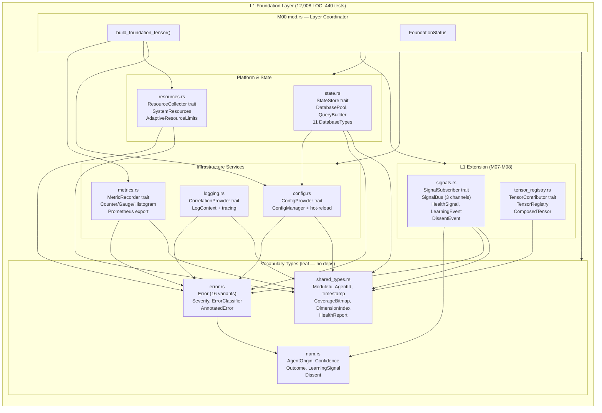
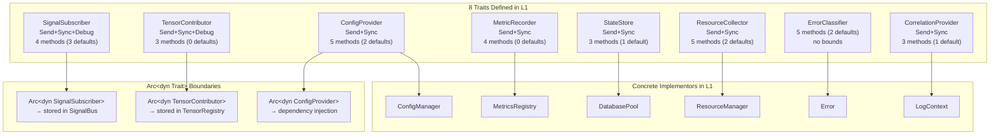
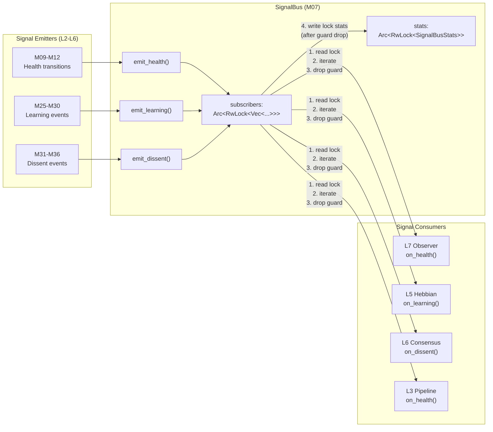
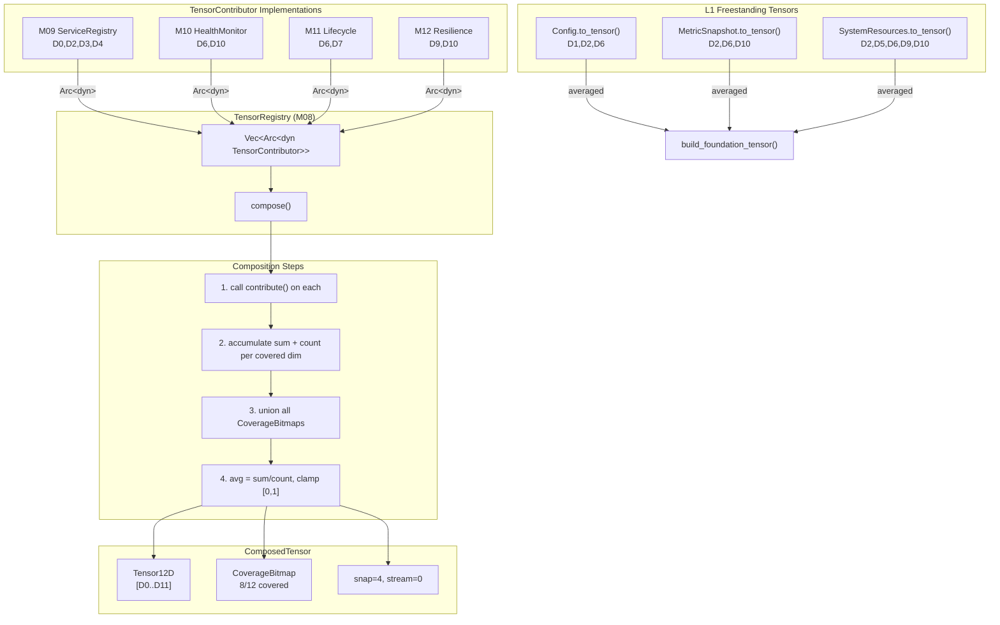
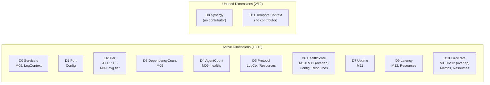
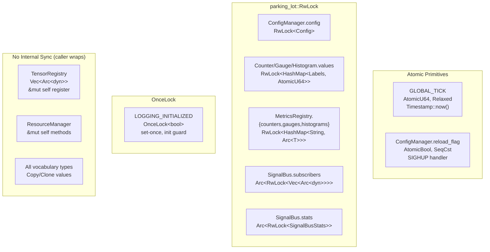
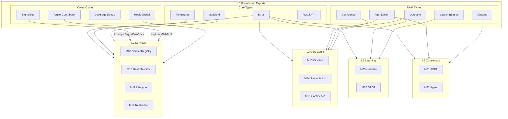
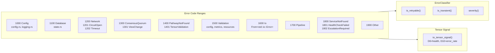
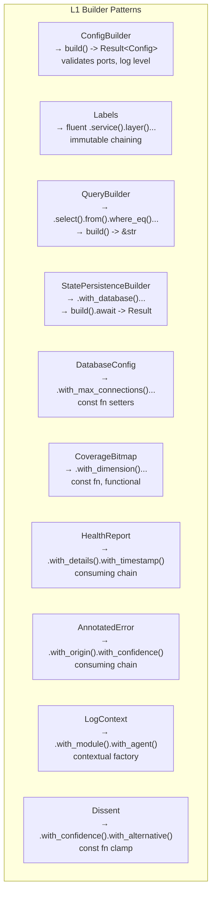

# L1 Foundation — Architectural Schematics

> **Purpose:** Visual reference for L1 architecture, dependencies, signal flow, tensor composition, and concurrency model.
> All diagrams are Mermaid markdown — render in any compatible viewer.

---

## 1. Layer Architecture

---

## 2. Trait Dependency Graph

---

## 3. Signal Flow Topology

**Locking protocol:** Read subscribers → call callbacks → drop guard → write stats. Guards are never held simultaneously (deadlock prevention).

---

## 4. Tensor Composition Pipeline

---

## 5. 12D Tensor Dimension Map

**D6 overlap:** M10 (probe-based health) + M11 (% running) → averaged. Intentional — complementary views.
**D10 overlap:** M10 (health check error rate) + M12 (circuit breaker failure rate) → averaged. Both valid signals.

---

## 6. Concurrency Model

**Lock ordering:** SignalBus always acquires subscribers lock BEFORE stats lock. Guards are dropped between acquisitions (not nested).

---

## 7. Cross-Layer Morphisms

**Direction:** Strictly downward (L7→L1). No L1 module imports from L2+.

---

## 8. Error Code Topology

---

## 9. Builder Pattern Inventory

All builder setters marked `#[must_use]`. Terminal methods that can fail return `Result`.

---

*L1 Foundation Architectural Schematics v1.0 | 2026-03-01*
