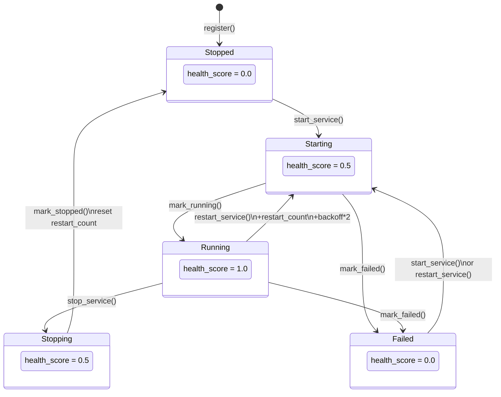
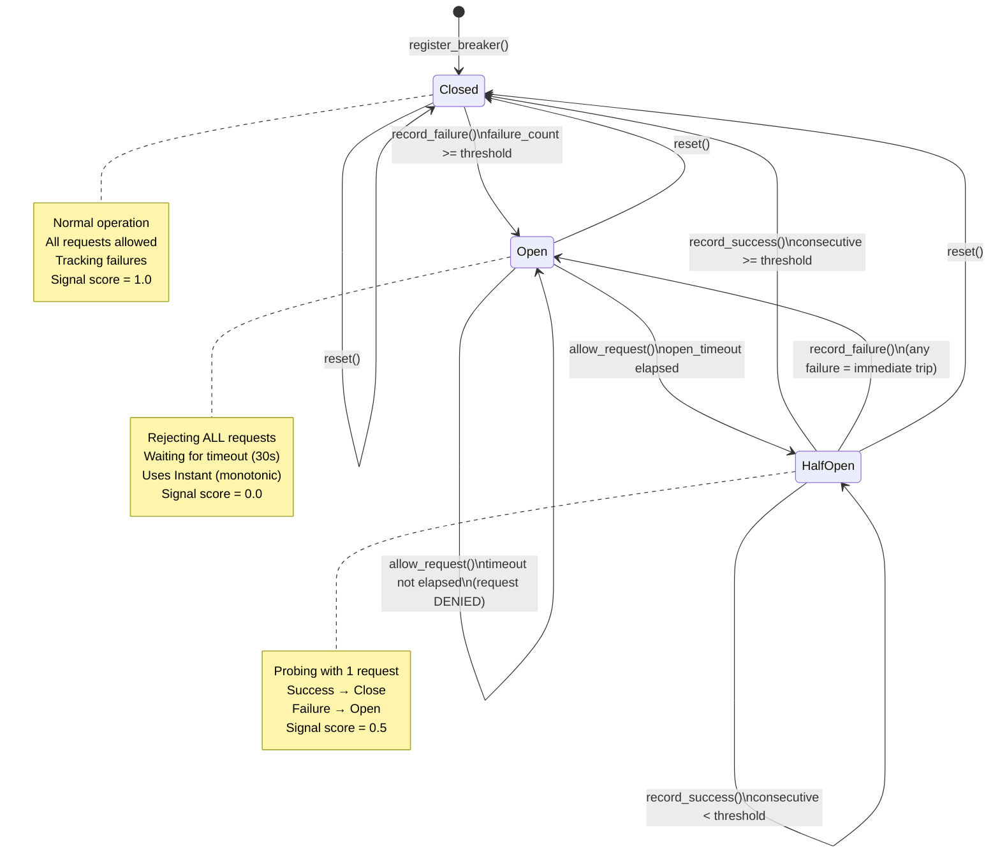
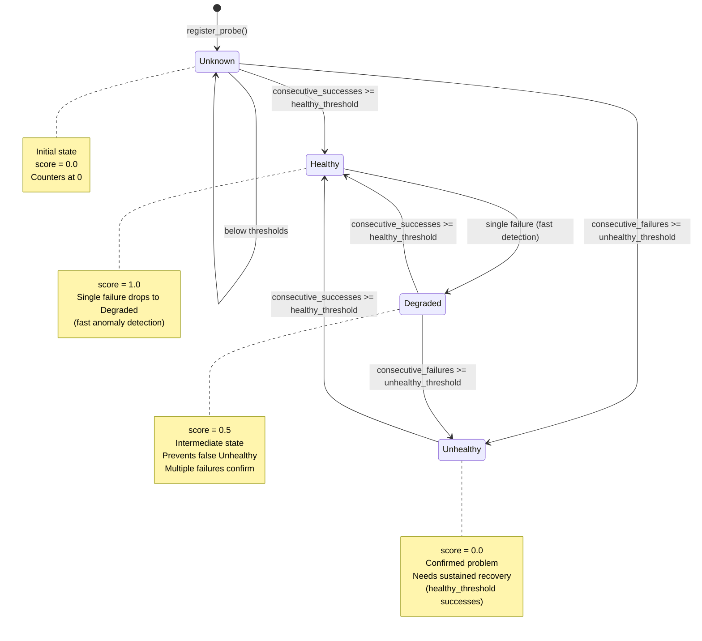
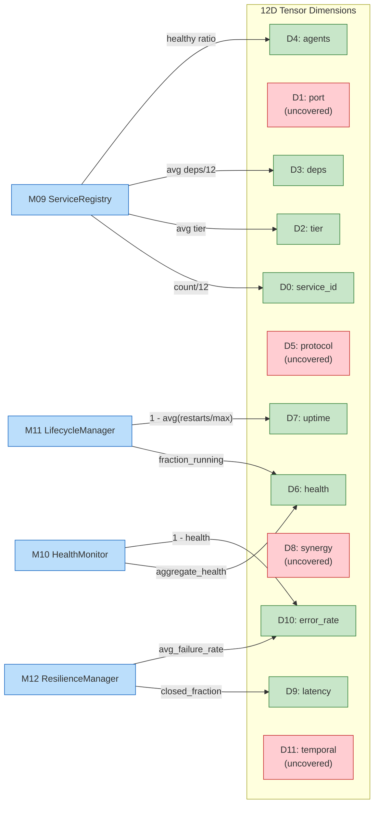
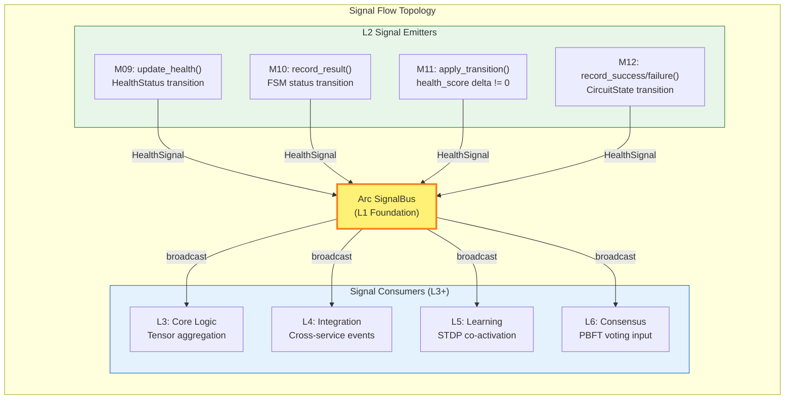
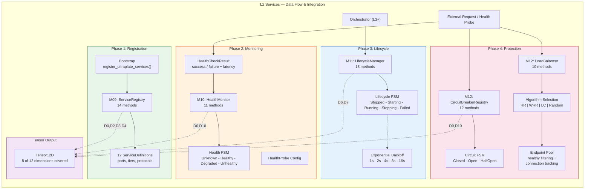
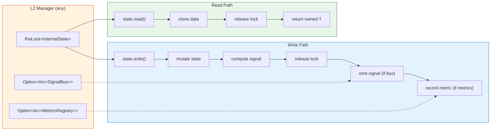

# M2 SERVICES LAYER — ARCHITECTURAL SCHEMATICS

> Visual architecture for The Maintenance Engine v1.0.0 — Layer 2 (Services)
> 7 Mermaid diagrams | Generated: 2026-03-01

---

## Table of Contents

1. [L2 Layer Architecture](#1-l2-layer-architecture)
2. [M11 Service Lifecycle FSM](#2-m11-service-lifecycle-fsm)
3. [M12 Circuit Breaker FSM](#3-m12-circuit-breaker-fsm)
4. [M10 Health Monitor FSM](#4-m10-health-monitor-fsm)
5. [Tensor Contribution Map](#5-tensor-contribution-map)
6. [Signal Flow Topology](#6-signal-flow-topology)
7. [Data Flow & Integration](#7-data-flow--integration)

---

## 1. L2 Layer Architecture

Complete component diagram showing all modules, traits, structs, and L1 dependencies.

```mermaid
graph TB
    subgraph L2["Layer 2: Services (7,196 LOC | 320 tests)"]
        direction TB

        subgraph MOD["mod.rs — Coordinator (694 LOC)"]
            SS["ServiceStatus<br/>Stopped|Starting|Running|Stopping|Failed"]
            HS["HealthStatus<br/>Healthy|Degraded|Unhealthy|Unknown"]
            ST["ServiceTier<br/>Tier1 w=1.5 .. Tier5 w=1.0"]
            CS["CircuitState<br/>Closed|Open|HalfOpen"]
            SVS["ServiceState<br/>id, name, status, health, tier,<br/>port, pid, scores, tensor"]
            RC["RestartConfig<br/>max_restarts: 5<br/>initial_backoff: 1s<br/>max_backoff: 30s"]
        end

        subgraph M09["M09: ServiceRegistry (1,285 LOC | 53 tests)"]
            SR["ServiceRegistry<br/>RwLock RegistryState"]
            SD_TRAIT["trait ServiceDiscovery<br/>14 methods"]
            SDEF["ServiceDefinition<br/>id, name, version, tier,<br/>host, port, protocol"]
            ULTRA["register_ultraplate_services<br/>12 services bootstrap"]
        end

        subgraph M10["M10: HealthMonitor (1,130 LOC | 49 tests)"]
            HM["HealthMonitor<br/>RwLock MonitorState"]
            HM_TRAIT["trait HealthMonitoring<br/>11 methods"]
            HP["HealthProbe<br/>endpoint, interval,<br/>thresholds"]
            HCR["HealthCheckResult<br/>status, response_time,<br/>message"]
        end

        subgraph M11["M11: LifecycleManager (1,898 LOC | 75 tests)"]
            LM["LifecycleManager<br/>RwLock HashMap"]
            LM_TRAIT["trait LifecycleOps<br/>18 methods"]
            LE["LifecycleEntry<br/>state, restart_count,<br/>backoff, history"]
            LA["LifecycleAction<br/>Start|Stop|Restart|HealthCheck"]
        end

        subgraph M12["M12: ResilienceManager (2,189 LOC | 82 tests)"]
            RM["ResilienceManager<br/>Facade"]
            CBR["CircuitBreakerRegistry<br/>RwLock HashMap"]
            LB["LoadBalancer<br/>RwLock HashMap"]
            CB_TRAIT["trait CircuitBreakerOps<br/>12 methods"]
            LB_TRAIT["trait LoadBalancing<br/>10 methods"]
            EP["Endpoint<br/>host, port, weight,<br/>connections, healthy"]
            LBA["LoadBalanceAlgorithm<br/>RoundRobin|Weighted|<br/>LeastConn|Random"]
        end
    end

    subgraph L1["Layer 1: Foundation"]
        ERR["Error / Result"]
        TS["Timestamp / Duration"]
        SB["Arc SignalBus"]
        TC["trait TensorContributor"]
        MR["Arc MetricsRegistry"]
        T12["Tensor12D"]
    end

    SR --> SD_TRAIT
    HM --> HM_TRAIT
    LM --> LM_TRAIT
    CBR --> CB_TRAIT
    LB --> LB_TRAIT
    RM --> CBR
    RM --> LB

    SR -.-> ERR
    SR -.-> SB
    SR -.-> TC
    HM -.-> ERR
    HM -.-> SB
    HM -.-> TC
    LM -.-> ERR
    LM -.-> SB
    LM -.-> TC
    RM -.-> TC
    RM -.-> MR

    SR -.-> TS
    HM -.-> TS
    LM -.-> TS
    CBR -.-> TS

    style L2 fill:#e3f2fd,stroke:#1565c0,stroke-width:2px
    style L1 fill:#f3e5f5,stroke:#7b1fa2,stroke-width:2px
    style MOD fill:#fff3e0,stroke:#e65100
    style M09 fill:#e8f5e9,stroke:#2e7d32
    style M10 fill:#e8f5e9,stroke:#2e7d32
    style M11 fill:#e8f5e9,stroke:#2e7d32
    style M12 fill:#e8f5e9,stroke:#2e7d32
```



---

## 2. M11 Service Lifecycle FSM

State machine governing service operational states with restart backoff.



### Backoff Sequence (defaults)

| Restart # | Backoff | Cumulative |
|-----------|---------|------------|
| 1 | 1s | 1s |
| 2 | 2s | 3s |
| 3 | 4s | 7s |
| 4 | 8s | 15s |
| 5 | 16s | 31s |
| 6+ | REJECTED | max_restarts exceeded |

---

## 3. M12 Circuit Breaker FSM

Three-state circuit breaker with timeout-based recovery probing.



### Default Thresholds

```
Closed→Open:     5 failures
HalfOpen→Closed: 3 consecutive successes
Open→HalfOpen:   30s timeout (monotonic Instant)
```

---

## 4. M10 Health Monitor FSM

Threshold-driven health status with Degraded intermediate state for flap prevention.



### Counter Reset Behavior

```
On success: consecutive_failures = 0, consecutive_successes += 1
On failure: consecutive_successes = 0, consecutive_failures += 1
```

This hysteresis mechanism ensures a single good/bad result resets the opposite counter, preventing oscillation.

---

## 5. Tensor Contribution Map

How L2's 4 modules populate 8 of 12 tensor dimensions.



### Dimension Overlap Notes

| Dimension | Contributors | Resolution |
|-----------|-------------|------------|
| D6 (health) | M10 + M11 | CoverageBitmap merge — averaged or higher-confidence wins |
| D10 (error_rate) | M10 + M12 | M10 = service-level health, M12 = request-level reliability |

### Coverage Summary

```
L2 covers: D0, D2, D3, D4, D6, D7, D9, D10  (8/12 = 67%)
Uncovered:  D1 (port), D5 (protocol), D8 (synergy), D11 (temporal)
            → Provided by L3 (Core Logic) and L4 (Integration)
```

---

## 6. Signal Flow Topology

How L2 modules emit health signals through the shared SignalBus.



### Emission Rules

- Signals are emitted **only on state transitions**, not on every API call
- M09: emits when `old_health != new_health`
- M10: emits when FSM state changes (e.g., Healthy→Degraded)
- M11: emits when `status_health_score(from) != status_health_score(to)`
- M12: emits on any circuit state change (Closed↔Open↔HalfOpen)

### Signal Payload

```rust
HealthSignal {
    service_id: String,
    score: f64,        // 0.0-1.0, quantized
    timestamp: Timestamp,
}
```

---

## 7. Data Flow & Integration

End-to-end request flow through all L2 modules showing 4 operational phases.



### Phase Dependencies

```
Phase 1 (Registration) → Independent, runs at startup
Phase 2 (Monitoring)   → Depends on Phase 1 for service definitions
Phase 3 (Lifecycle)    → Driven by orchestrator, may trigger Phase 2 re-checks
Phase 4 (Protection)   → Independent, operates on request path
                          Circuit breakers may trigger Phase 3 restarts
```

### Request Path (Phase 4 Detail)

```
Incoming Request
    │
    ▼
allow_request(service_id)  ← CircuitBreakerOps
    │
    ├── Denied (Open) → Error response
    │
    └── Allowed (Closed/HalfOpen)
            │
            ▼
        select_endpoint(service_id)  ← LoadBalancing
            │                         (active_connections++)
            ▼
        Forward to endpoint
            │
            ├── Success → record_request(success)
            │              record_success() on circuit
            │              (active_connections--)
            │
            └── Failure → record_request(failure)
                           record_failure() on circuit
                           (active_connections--, errors++)
```

---

## Appendix: Concurrency Architecture

All L2 managers share this interior mutability pattern:



### Key Properties

- **No `std::sync::RwLock`** — All locks are `parking_lot::RwLock` (no poisoning, faster)
- **Signal emission after lock release** — Prevents deadlock if signal handler acquires another lock
- **Owned returns (C7)** — All data crossing lock boundaries is cloned, preventing lock lifetime leaks
- **No nested locks** — Each manager has exactly one `RwLock`, never holds two simultaneously

---

*Generated: 2026-03-01 | The Maintenance Engine v1.0.0 | 7 Architectural Schematics*
